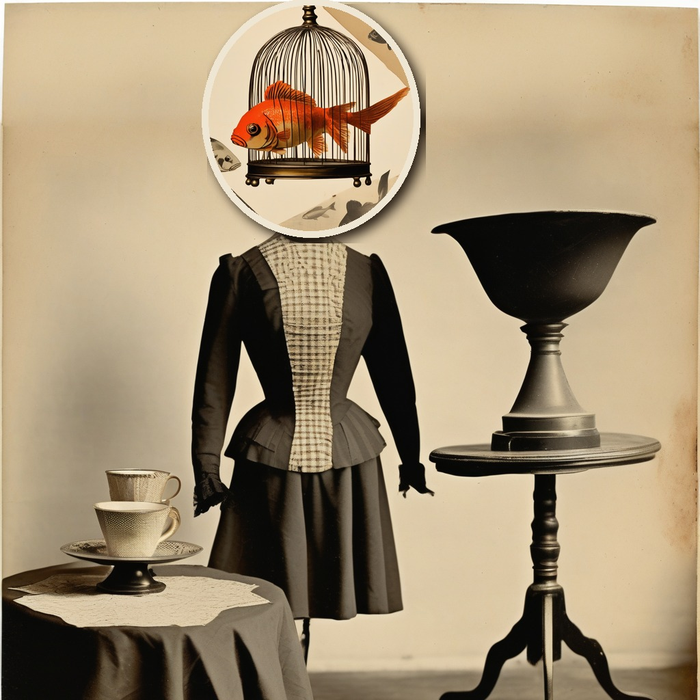
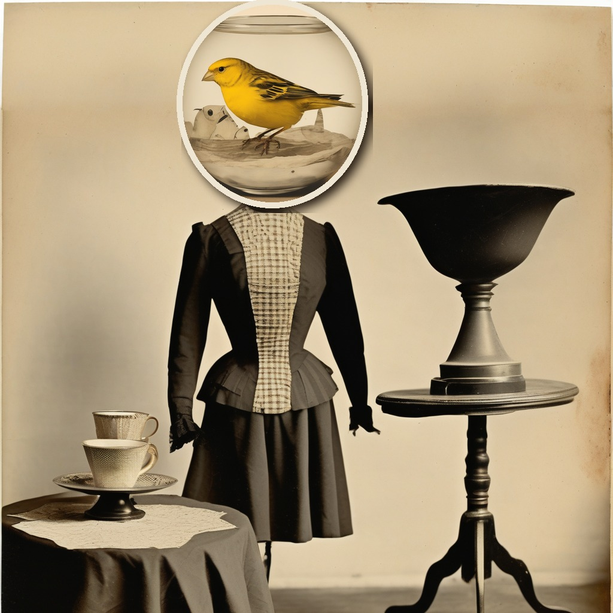
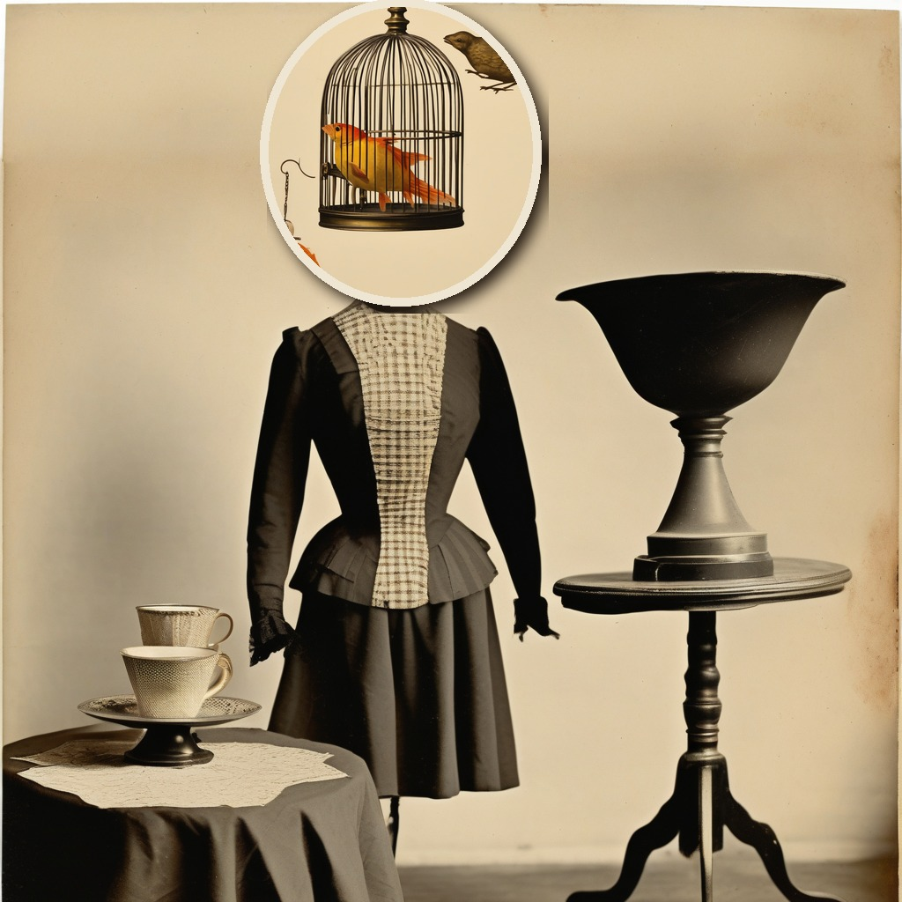

# Assignment 1: Surrealistic Collage

**The Swap.** A three-part photomontage series made with Hugging Face [`diffusers`](https://github.com/huggingface/diffusers) and Stable Diffusion XL, in the manner of Hannah Höch and Max Ernst.

A headless Victorian dress form (the Surrealists' favourite mannequin) keeps trading heads. First it wears a birdcage, but the goldfish has moved in. Then a fishbowl, with a very unimpressed canary sitting in the water. By the third swap the exchange has gone too far: back in the birdcage, the goldfish has grown feathers, and a bird has already slipped out to perch on top.

| 1 | 2 | 3 |
|---|---|---|
|  |  |  |
| [prompt](surreal_collage_1.txt) | [prompt](surreal_collage_2.txt) | [prompt](surreal_collage_3.txt) |

## How it's made

Every piece is generated by SDXL, and the collage is assembled in Python. That's the Höch method: fragments of found images, cut and pasted.

1. **Base plate.** One text-to-image generation (seed 498, picked from a seed sweep in the notebook) of the headless dress form beside a teacup. The same plate is used for all three images.
2. **Headroom.** The plate is shifted down and the strip above it is outpainted once with the SDXL inpainting model, so the three images share an identical background.
3. **Head fragments.** Each "head" (birdcage + goldfish, fishbowl + canary, empty cage + both) is generated separately, cut out as an oval with a paper border and shadow, and pasted on the neck.

AI use disclosure. Claude (Anthropic, model claude-opus-5-5, via claude.ai) was used to read the brief, develop the concept, write the prompts and the diffusers/PIL code, run the notebook in Colab, and draft this README.

